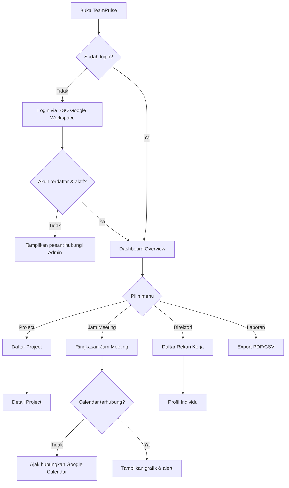
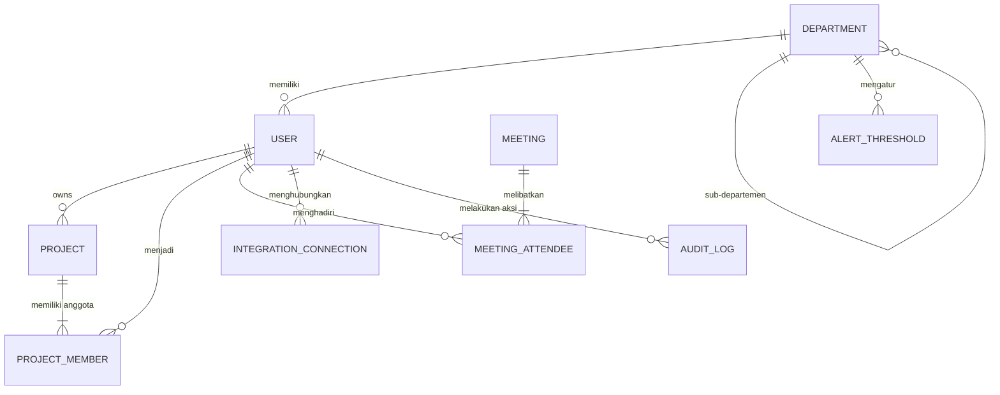
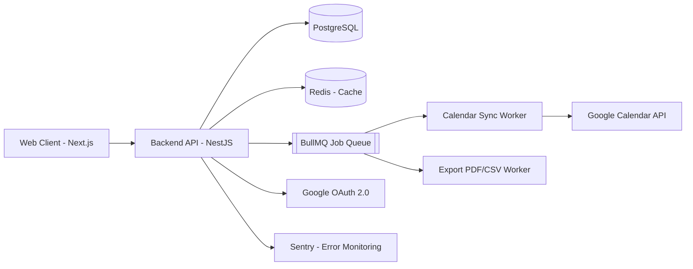
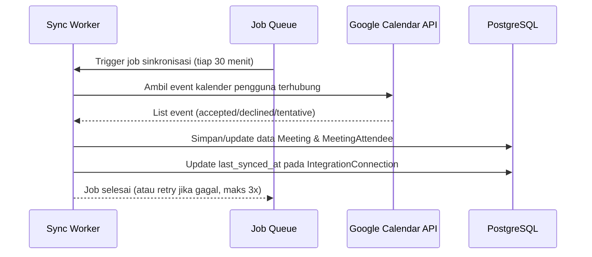
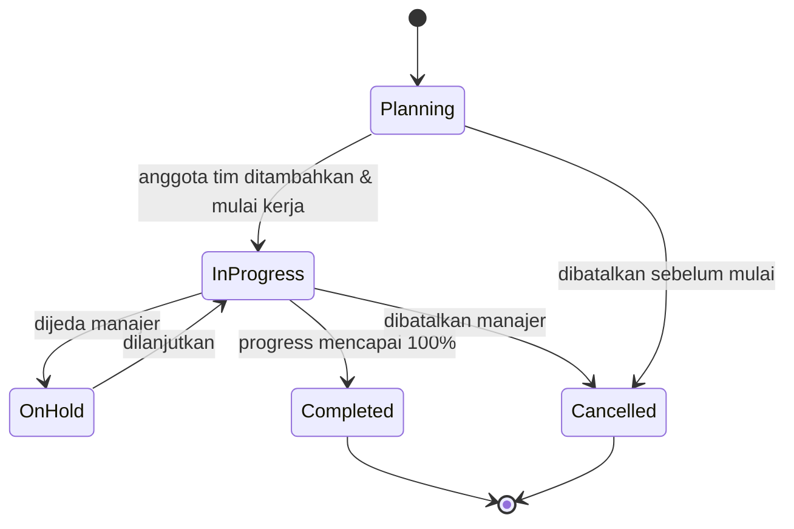
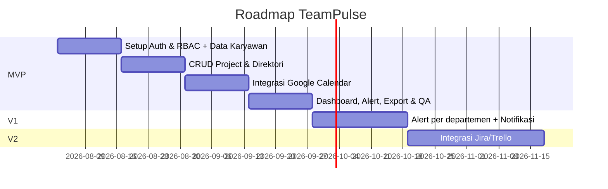

# PRD — TeamPulse: Dashboard Kinerja Perusahaan
**Versi:** 1.0 · **Tanggal:** 17 Juli 2026 · **Status:** Draft untuk validasi stakeholder

---

## 1. Executive Summary

TeamPulse adalah dashboard internal yang memberikan visibilitas terpusat atas tiga hal yang paling sering ditanyakan manajemen tapi paling jarang terlihat jelas: **progres project**, **beban jam meeting**, dan **siapa mengerjakan apa** (direktori & workload rekan kerja). Saat ini data ini tersebar di kalender, spreadsheet, dan tools project management yang berbeda-beda, sehingga manajer harus mengumpulkan manual sebelum bisa mengambil keputusan resourcing.

TeamPulse menggabungkan data ini dalam satu tampilan, dengan level akses berbeda untuk karyawan, manajer, dan admin/HR. Metrik utama keberhasilan: **waktu yang dibutuhkan manajer untuk menyusun laporan kinerja tim turun signifikan**, dan **adopsi mingguan oleh karyawan** sebagai sinyal bahwa dashboard ini benar-benar dipakai, bukan sekadar dilihat sekali.

Dokumen ini dibuat berdasarkan brief awal yang ringkas. Karena sesi tanya-jawab discovery belum terisi jawabannya di percakapan ini, seluruh keputusan yang tidak eksplisit dinyatakan pengguna ditandai sebagai **AI Assumption** di Bagian 2 — silakan koreksi sebelum tim mulai membangun.

---

## 2. Validation Summary

### Confirmed Information (dari brief pengguna)
- Produk adalah **dashboard kinerja perusahaan** untuk kebutuhan internal.
- Tiga area data inti: **(1) project**, **(2) jam meeting**, **(3) daftar/list rekan kerja**.

### AI Assumptions (perlu dikonfirmasi ulang)
| # | Asumsi | Alasan |
|---|---|---|
| A1 | Pengguna utama adalah **manajemen + karyawan dengan level akses berbeda** (bukan hanya leadership atau hanya HR) | "Kinerja perusahaan" biasanya perlu dilihat top-down oleh manajemen, tapi data project & meeting paling akurat kalau karyawan juga bisa lihat & update datanya sendiri |
| A2 | Sumber data adalah **kombinasi input manual + integrasi tools yang sudah dipakai** (Google Calendar untuk meeting, Jira/Trello/Asana untuk project) | Ini paling realistis untuk MVP — integrasi penuh butuh waktu, input manual murni tidak scalable dan gampang basi |
| A3 | Platform target adalah **web app internal** (bukan mobile-first) | Dashboard analitik biasanya dikonsumsi dari desktop saat kerja; mobile bisa jadi fase lanjutan |
| A4 | Skala: **satu perusahaan (single-tenant)**, estimasi 50–500 karyawan, tanpa kebutuhan multi-bahasa selain Bahasa Indonesia + Inggris untuk label teknis | Tidak disebutkan skala; ini asumsi ukuran perusahaan menengah yang umum untuk internal tool semacam ini |
| A5 | Autentikasi menggunakan **SSO Google Workspace** | Karena integrasi Google Calendar diasumsikan (A2), SSO Google paling natural dan mengurangi friksi login |
| A6 | Tidak ada kebutuhan monetisasi — ini **internal cost-center tool**, bukan produk yang dijual | "Kinerja perusahaan" menyiratkan tool internal, bukan produk SaaS eksternal |
| A7 | Tidak ada target tanggal MVP yang ketat; roadmap disusun dalam siklus **8–10 minggu untuk MVP** | Tidak disebutkan deadline |
| A8 | Data project mencakup: nama, status, timeline, progress %, dan anggota tim — **tanpa modul finansial/budget** di MVP | Fokus brief adalah kinerja & waktu, bukan biaya |

### Open Questions (perlu divalidasi sebelum development dimulai)
- Apakah perusahaan sudah punya tools project management existing (Jira/Trello/Asana/Notion) yang wajib diintegrasikan, atau boleh mulai dari input manual dulu?
- Apakah "jam meeting" perlu dibedakan antara meeting internal vs eksternal (klien)?
- Apakah ada kebutuhan approval/persetujuan atasan untuk data yang di-input (misal jam kerja/project progress), atau cukup self-report?
- Siapa yang berwenang membuat/menghapus project — semua manajer, atau hanya PMO/admin?
- Apakah dashboard ini nanti perlu terhubung ke sistem HRIS/payroll yang sudah ada?

> **Catatan:** Karena pertanyaan discovery belum terjawab secara eksplisit di percakapan, dokumen ini dibangun di atas asumsi A1–A8 di atas agar tim tetap bisa mulai bekerja. Bagian yang paling penting untuk dikonfirmasi ulang sebelum sprint pertama: **A1 (siapa pengguna), A2 (sumber data/integrasi), dan A7 (target waktu)** — ketiganya paling besar pengaruhnya terhadap scope.

---

## 3. Problem Statement & Opportunity

Manajer dan leadership butuh menjawab pertanyaan sederhana secara rutin: *"Tim mana yang overload meeting minggu ini?"*, *"Project mana yang mulai delay?"*, *"Siapa saja yang ada di tim X dan sedang mengerjakan apa?"* — tapi jawabannya tersebar di Google Calendar, tools project (jika ada), dan ingatan masing-masing orang.

Akibatnya:
- Laporan kinerja tim disusun manual tiap minggu/bulan, memakan waktu dan rawan human error.
- Overload meeting baru terlihat setelah karyawan burnout, bukan sebagai sinyal dini.
- Karyawan baru kesulitan tahu siapa mengerjakan apa dan harus bertanya manual (tidak ada single source of truth soal struktur tim & keahlian).
- Keputusan resourcing (siapa dialokasikan ke project baru) dibuat tanpa data beban kerja real-time.

**Peluang:** dengan menyatukan tiga data ini dalam satu dashboard yang ringan untuk diadopsi, perusahaan mendapat visibilitas real-time tanpa perlu tools enterprise yang berat (seperti full HRIS atau BI platform mahal).

---

## 4. Product Vision & Goals

**Visi:** Menjadi satu tempat yang dicek tim manajemen setiap Senin pagi untuk memahami kesehatan operasional tim — tanpa perlu mengumpulkan laporan manual.

**Misi:** Menyediakan visibilitas real-time atas project, beban meeting, dan struktur tim dengan effort input seminimal mungkin dari karyawan.

**Value proposition:** "Satu dashboard, tiga jawaban: apa yang sedang dikerjakan, berapa banyak waktu terpakai untuk meeting, dan siapa mengerjakannya."

**North Star Metric:** Jumlah manajer/tim aktif yang membuka dashboard minimal 1x per minggu (weekly active managers).

**Product Goals (3–5):**
1. Mengurangi waktu yang dihabiskan manajer menyusun laporan kinerja tim mingguan/bulanan.
2. Memberikan sinyal dini beban meeting berlebih sebelum berdampak ke produktivitas/burnout.
3. Menjadi direktori tim yang selalu up to date (siapa, di project apa, dengan peran apa).
4. Mendorong project owner untuk rutin update status project (bukan hanya dilihat, tapi juga dipelihara).
5. Menyediakan fondasi data yang bisa diperluas ke modul kinerja individu (performance review) di fase berikutnya.

---

## 5. Success Metrics

| Goal | Leading Indicator | Lagging Indicator |
|---|---|---|
| Adopsi rutin | % manajer login ≥1x/minggu | Weekly Active Users (WAU) / total karyawan terdaftar |
| Kurangi waktu laporan manual | Jumlah export/laporan yang digenerate dari dashboard | Survei kepuasan manajer soal waktu penyusunan laporan (before/after) |
| Deteksi overload meeting | Jumlah alert "jam meeting tinggi" yang muncul per minggu | Tren rata-rata jam meeting per karyawan per bulan (harus stabil/turun) |
| Data project selalu fresh | % project dengan update status dalam 7 hari terakhir | Rasio project "stale" (>14 hari tanpa update) |
| Direktori akurat | % profil karyawan lengkap (foto, role, project aktif) | Jumlah karyawan aktif tapi belum ter-assign ke project apapun (indikasi data tidak sinkron) |

---

## 6. Stakeholder Analysis

| Stakeholder | Peran |
|---|---|
| Sponsor bisnis (mis. Head of Operations/COO) | Menentukan prioritas & anggaran, penerima laporan tingkat perusahaan |
| Manajer/Team Lead | Pengguna utama, sumber kebutuhan fitur harian |
| Karyawan | Pengguna sekunder, sumber data (self-report), konsumen direktori |
| HR/People Ops | Mengelola data karyawan & struktur organisasi |
| IT/Admin Sistem | Mengelola integrasi (Google Workspace, tools project), keamanan akses |
| Engineering Team | Membangun & memelihara sistem |

### RACI — Keputusan Utama

| Keputusan | Sponsor Bisnis | Manajer | HR | IT/Admin | Engineering |
|---|---|---|---|---|---|
| Prioritas fitur MVP | A | C | C | I | R |
| Struktur role & permission | C | C | A | R | R |
| Integrasi tools eksternal (Calendar/Jira) | I | C | I | A | R |
| Kebijakan retensi & privasi data | A | I | R | C | C |
| Go-live/rilis | A | I | I | C | R |

*(R = Responsible, A = Accountable, C = Consulted, I = Informed)*

---

## 7. User Segmentation & Personas

### Persona 1 — Rani, Team Lead / Manajer (Primary)
- **Peran:** Memimpin tim 6–10 orang, bertanggung jawab atas 2–3 project berjalan.
- **Goals:** Melihat cepat status semua project timnya, tahu siapa yang kelebihan beban meeting, siapkan laporan mingguan tanpa harus tanya satu-satu ke anggota tim.
- **Pain points:** Harus buka Google Calendar + Jira + tanya Slack manual tiap minggu untuk update ke atasan.
- **Perilaku:** Cek dashboard tiap Senin pagi dan sebelum meeting mingguan dengan atasannya. Menggunakan desktop di jam kerja.
- **Literasi teknis:** Menengah — nyaman dengan tools SaaS, tidak butuh training panjang.

### Persona 2 — Dimas, Karyawan/Individual Contributor
- **Peran:** Anggota tim di 1–2 project sekaligus.
- **Goals:** Tahu siapa saja rekan satu project (terutama saat onboarding project baru), update status task/project miliknya dengan cepat.
- **Pain points:** Tidak tahu siapa PIC dari tim lain saat butuh koordinasi lintas divisi; sering ditanya manual soal statusnya oleh manajer.
- **Perilaku:** Buka dashboard saat ada notifikasi atau saat butuh cari kontak rekan kerja.
- **Literasi teknis:** Bervariasi (asumsi umum, menengah).

### Persona 3 — Sari, HR/People Ops (Admin)
- **Peran:** Mengelola data karyawan, struktur departemen, dan onboarding/offboarding.
- **Goals:** Data karyawan selalu akurat, bisa generate laporan kinerja/beban kerja untuk leadership tanpa proses manual.
- **Pain points:** Data karyawan tersebar di spreadsheet berbeda-beda antar departemen.
- **Perilaku:** Mengelola dashboard secara berkala (mingguan/bulanan), bukan harian.
- **Literasi teknis:** Menengah–tinggi.

### Persona 4 — Budi, Leadership/COO (Secondary, view-only)
- **Peran:** Melihat ringkasan kinerja perusahaan secara keseluruhan.
- **Goals:** Snapshot cepat kesehatan operasional lintas divisi tanpa detail teknis.
- **Perilaku:** Cek dashboard ringkasan sebelum rapat direksi bulanan.

---

## 8. Jobs To Be Done

- **Rani (Manajer):** *Ketika* saya harus menyiapkan laporan mingguan ke atasan, *saya ingin* melihat status semua project tim saya dalam satu layar, *sehingga* saya tidak perlu mengumpulkan data manual dari tiap anggota tim.
- **Rani (Manajer):** *Ketika* saya merencanakan minggu depan, *saya ingin* tahu siapa di tim saya yang jam meeting-nya sudah terlalu padat, *sehingga* saya bisa redistribusi beban sebelum terjadi burnout.
- **Dimas (Karyawan):** *Ketika* saya baru gabung ke project baru, *saya ingin* melihat siapa saja anggota tim dan perannya, *sehingga* saya tahu harus koordinasi dengan siapa.
- **Sari (HR):** *Ketika* leadership minta laporan kinerja bulanan, *saya ingin* mengekspor ringkasan data project & beban kerja langsung dari dashboard, *sehingga* saya tidak perlu rekap manual dari banyak sumber.
- **Budi (Leadership):** *Ketika* saya menyiapkan rapat direksi, *saya ingin* melihat ringkasan kesehatan operasional seluruh divisi dalam satu tampilan, *sehingga* saya bisa mengambil keputusan strategis dengan cepat.

---

## 9. User Journey (Persona Utama: Rani, Manajer)

1. **Trigger:** Senin pagi, Rani perlu menyiapkan update mingguan untuk atasannya.
2. **Login:** Masuk via SSO Google Workspace — tanpa perlu password terpisah.
3. **Landing di Dashboard Overview:** Melihat ringkasan: jumlah project aktif timnya, total jam meeting tim minggu ini, dan alert jika ada anggota tim overload.
4. **Drill-down Project:** Klik ke project yang statusnya "At Risk" untuk lihat detail — siapa PIC, apa yang menghambat.
5. **Cek Direktori Tim:** Melihat daftar anggota tim dan alokasi mereka ke project lain (untuk tahu siapa yang punya kapasitas tambahan).
6. **Export/Share:** Ekspor ringkasan sebagai laporan (PDF/link) untuk dilampirkan ke laporan mingguan.
7. **Outcome:** Laporan selesai dalam hitungan menit, bukan puluhan menit mengumpulkan data manual.

*Momen di luar produk:* Onboarding Rani ke tool ini (training singkat 15 menit dari HR/IT saat rollout), dan support channel (Slack/email) jika data tidak sinkron dari integrasi kalender.

---

## 10. Product Scope

### In Scope (MVP)
- Autentikasi via SSO Google Workspace, dengan role: Admin, Manajer, Karyawan.
- Manajemen data karyawan & struktur departemen (oleh Admin/HR).
- Manajemen project: create/update/list, status, progress %, anggota tim.
- Pencatatan & agregasi jam meeting per karyawan/tim (integrasi Google Calendar + opsi input manual untuk meeting eksternal yang tidak tercatat kalender).
- Direktori rekan kerja: profil, departemen, project aktif, kontak.
- Dashboard overview dengan filter per departemen/tim/rentang waktu.
- Alert sederhana untuk beban meeting tinggi (threshold dikonfigurasi admin).
- Export laporan ringkas (PDF/CSV).

### Out of Scope (MVP)
- Modul payroll/HRIS penuh (cuti, gaji, kontrak kerja).
- Modul finansial/budget project.
- Performance review formal (KPI scoring, appraisal).
- Aplikasi mobile native.
- Integrasi selain Google Calendar (Jira/Trello/Asana masuk fase berikutnya jika dikonfirmasi dibutuhkan).

### Future Scope
- Integrasi project management tools (Jira, Trello, Asana, Notion).
- Modul performance review terhubung ke data project & meeting.
- Aplikasi mobile.
- Multi-tenant (jika produk ini nantinya ditawarkan ke perusahaan lain).
- Insight berbasis AI (rekomendasi redistribusi beban kerja otomatis).

### MVP Scope vs Post-MVP — MoSCoW

| Fitur | Prioritas |
|---|---|
| Login SSO + RBAC (Admin/Manajer/Karyawan) | Must |
| CRUD Project + status + progress | Must |
| Integrasi Google Calendar → jam meeting | Must |
| Direktori karyawan | Must |
| Dashboard overview + filter | Must |
| Alert overload meeting | Should |
| Export laporan PDF/CSV | Should |
| Input manual meeting eksternal | Should |
| Integrasi Jira/Trello | Could |
| Mobile app | Won't (fase ini) |
| Performance review/KPI scoring | Won't (fase ini) |

---

## 11. Feature Breakdown & Story Mapping

**Epic A — Identitas & Akses**
- Capability: Autentikasi & Otorisasi
  - Feature: Login SSO Google Workspace
  - Feature: Manajemen role & permission (RBAC)

**Epic B — Manajemen Project**
- Capability: Project Lifecycle
  - Feature: Buat/edit/arsipkan project
  - Feature: Assign anggota tim ke project
  - Feature: Update status & progress project

**Epic C — Jam Meeting**
- Capability: Pelacakan Waktu Meeting
  - Feature: Sinkronisasi Google Calendar
  - Feature: Input manual meeting eksternal
  - Feature: Alert beban meeting tinggi

**Epic D — Direktori Tim**
- Capability: Profil & Struktur Organisasi
  - Feature: Direktori karyawan dengan pencarian & filter
  - Feature: Halaman profil individu (project aktif, departemen, kontak)

**Epic E — Dashboard & Laporan**
- Capability: Visibilitas Agregat
  - Feature: Dashboard overview (KPI perusahaan/tim)
  - Feature: Export laporan (PDF/CSV)

### Contoh User Stories & Acceptance Criteria

```
Epic B — Manajemen Project

As a Manajer,
I want to membuat project baru dan menambahkan anggota tim,
So that saya bisa mulai melacak progresnya di dashboard.

Acceptance Criteria:
- Given saya login sebagai Manajer, when saya membuka "Buat Project Baru", 
  then saya bisa mengisi nama, deskripsi, tanggal mulai/selesai, dan prioritas.
- Given form project sudah diisi lengkap, when saya klik "Simpan",
  then project muncul di daftar project saya dengan status default "Planning".
- Given project sudah dibuat, when saya menambahkan anggota tim,
  then anggota tersebut menerima notifikasi email dan project muncul di profil mereka.
- Given saya mengisi tanggal selesai lebih awal dari tanggal mulai,
  when saya klik "Simpan", then sistem menampilkan error validasi dan tidak menyimpan data.
```

```
Epic C — Jam Meeting

As a Karyawan,
I want to melihat total jam meeting saya minggu ini,
So that saya sadar jika beban meeting saya sudah berlebihan.

Acceptance Criteria:
- Given kalender Google saya sudah terhubung, when saya membuka dashboard pribadi,
  then saya melihat total jam meeting minggu ini dan perbandingan dengan minggu lalu.
- Given total jam meeting saya melebihi threshold yang dikonfigurasi admin (misal 15 jam/minggu),
  when saya membuka dashboard, then muncul indikator visual (badge/warna) yang menandakan overload.
- Given kalender saya belum terhubung, when saya membuka bagian jam meeting,
  then sistem menampilkan ajakan untuk menghubungkan Google Calendar, bukan data kosong tanpa penjelasan.
```

```
Epic D — Direktori Tim

As a Karyawan,
I want to mencari rekan kerja berdasarkan nama atau departemen,
So that saya cepat menemukan kontak yang tepat saat butuh koordinasi.

Acceptance Criteria:
- Given saya berada di halaman Direktori, when saya mengetik nama di kolom pencarian,
  then hasil terfilter secara real-time (debounce 300ms).
- Given saya memfilter berdasarkan departemen, when hasil tampil,
  then setiap kartu karyawan menampilkan foto, nama, jabatan, dan project aktif.
- Given saya klik salah satu profil, when halaman profil terbuka,
  then saya melihat daftar project yang diikuti dan info kontak (email).
```

*(Story mapping lengkap untuk semua epic mengikuti pola yang sama — dokumen ini menyertakan contoh representatif per epic; tim dapat memperluas sesuai kebutuhan sprint planning.)*

---

## 12. Information Architecture

```
TeamPulse
├── Login (SSO)
├── Dashboard Overview
│   ├── Ringkasan KPI Perusahaan/Tim
│   ├── Alert Beban Meeting
│   └── Project "At Risk"
├── Project
│   ├── Daftar Project (filter: status, departemen, owner)
│   └── Detail Project (info, anggota, timeline, progress)
├── Jam Meeting
│   ├── Ringkasan Pribadi
│   └── Ringkasan Tim/Departemen (khusus Manajer/Admin)
├── Direktori Rekan Kerja
│   ├── Daftar & Pencarian
│   └── Profil Individu
├── Laporan
│   └── Export PDF/CSV
├── Admin Panel (khusus Admin/HR)
│   ├── Manajemen Karyawan
│   ├── Manajemen Departemen
│   ├── Pengaturan Integrasi
│   └── Pengaturan Threshold Alert
└── Profil & Pengaturan Akun
```

---

## 13. User Flow & Task Flow



**Edge cases & empty states yang perlu ditangani secara eksplisit:**
- Karyawan baru tanpa project apapun → tampilkan empty state ajakan "belum ada project, hubungi manajer Anda".
- Google Calendar gagal sync (token expired) → tampilkan banner peringatan + tombol reconnect, jangan tampilkan data jam meeting yang salah/basi.
- Project tanpa anggota tim → status project tetap bisa "Planning" tapi diberi warning di list.
- Manajer mencoba menghapus project yang masih punya anggota aktif → minta konfirmasi eksplisit, bukan hard delete langsung (soft delete/arsip).
- Loading state untuk semua grafik dashboard → skeleton loader, bukan layar kosong/putih.

---

## 14. Screen Inventory

### Dashboard Overview
- **Objective:** Snapshot cepat kesehatan tim/perusahaan.
- **Key components:** Kartu KPI (jumlah project aktif, total jam meeting minggu ini, jumlah alert overload), grafik tren jam meeting, daftar project "At Risk".
- **Inputs & validation:** Filter departemen/tim (dropdown), filter rentang waktu (date range picker, default 7 hari terakhir).
- **Outputs:** Data teragregasi real-time (cache maks. 15 menit).
- **States:** Default (data ada), loading (skeleton), empty (belum ada project/tim terdaftar), error (gagal fetch data, tampilkan retry).
- **User actions:** Ubah filter, klik kartu untuk drill-down.

### Daftar & Detail Project
- **Objective:** Melihat dan mengelola semua project.
- **Key components:** Tabel/kanban project (nama, status, progress bar, owner, jumlah anggota), form create/edit.
- **Inputs & validation:** Nama (wajib, maks 100 karakter), tanggal mulai < tanggal selesai (wajib), status (enum: Planning/In Progress/On Hold/Completed/Cancelled), anggota tim (minimal 1 untuk status selain Planning).
- **Outputs:** Detail project dengan timeline & daftar anggota.
- **States:** Default, loading, empty (belum ada project — CTA "Buat Project Baru"), error validasi form.
- **User actions:** Create, edit, arsipkan (soft delete), assign/remove anggota, ubah status.
- **Error handling:** Validasi inline per field, toast error untuk kegagalan simpan.

### Jam Meeting
- **Objective:** Melihat beban meeting individu/tim.
- **Key components:** Grafik total jam per minggu, breakdown per hari, indikator overload.
- **Inputs & validation:** Filter rentang waktu, filter per anggota tim (khusus Manajer).
- **Outputs:** Total jam, tren dibanding periode sebelumnya, daftar meeting terbanyak durasinya.
- **States:** Default, loading, empty (calendar belum terhubung — CTA connect), error (sync gagal).
- **User actions:** Hubungkan/putuskan Google Calendar, tambah meeting manual (eksternal), ubah threshold alert (Admin).

### Direktori Rekan Kerja
- **Objective:** Mencari & melihat profil rekan kerja.
- **Key components:** Search bar, filter departemen, grid/list kartu profil.
- **Inputs & validation:** Search query (min 1 karakter, debounce 300ms).
- **Outputs:** Daftar karyawan sesuai filter, profil detail per klik.
- **States:** Default, loading, empty (tidak ada hasil pencarian), error.
- **User actions:** Cari, filter, klik profil, (Admin) tambah/edit/nonaktifkan karyawan.

### Admin Panel
- **Objective:** Kelola data master (karyawan, departemen, integrasi, threshold).
- **Key components:** Tabel manajemen karyawan, form departemen, pengaturan integrasi, slider/input threshold alert.
- **Inputs & validation:** Email karyawan harus domain perusahaan (validasi format & domain), role wajib dipilih.
- **Outputs:** Konfirmasi perubahan tersimpan.
- **States:** Default, loading, error (misal email duplikat).
- **User actions:** CRUD karyawan & departemen, atur integrasi, atur threshold alert global.

---

## 15. Functional Requirements

**Autentikasi & Otorisasi**
- FR-1: Sistem harus mendukung login via SSO Google Workspace menggunakan domain email perusahaan yang terdaftar.
- FR-2: Sistem harus menolak login dari domain email yang tidak terdaftar sebagai domain perusahaan.
- FR-3: Sistem harus menerapkan tiga role: Admin, Manajer, Karyawan, dengan permission berbeda (lihat Bagian 21).
- FR-4: Admin harus bisa mengubah role seorang pengguna kapan saja; perubahan berlaku pada login berikutnya.

**Manajemen Project**
- FR-5: Manajer dan Admin harus bisa membuat project baru dengan field: nama, deskripsi, tanggal mulai, tanggal selesai, prioritas, status.
- FR-6: Sistem harus menolak penyimpanan project jika tanggal selesai lebih awal dari tanggal mulai.
- FR-7: Manajer harus bisa menambahkan/menghapus anggota tim dari project yang mereka miliki (owner).
- FR-8: Karyawan yang menjadi anggota project harus bisa mengubah progress % project tersebut (bukan field lain seperti tanggal/anggota).
- FR-9: Sistem harus mencatat riwayat perubahan status project (audit trail: siapa, kapan, dari status apa ke status apa).
- FR-10: Project yang dihapus harus menjadi soft-delete (diarsipkan), bukan dihapus permanen dari database.

**Jam Meeting**
- FR-11: Sistem harus melakukan sinkronisasi data meeting dari Google Calendar setiap 30 menit untuk pengguna yang sudah menghubungkan akunnya.
- FR-12: Sistem harus menghitung total jam meeting per pengguna per rentang waktu (harian/mingguan/bulanan) berdasarkan durasi event kalender yang pengguna tersebut hadiri.
- FR-13: Sistem harus mengizinkan pengguna menandai event kalender tertentu sebagai "bukan meeting kerja" (misal: fokus block, cuti) agar tidak ikut terhitung.
- FR-14: Sistem harus mengizinkan input manual untuk meeting eksternal yang tidak tercatat di Google Calendar.
- FR-15: Sistem harus memicu alert visual saat total jam meeting mingguan pengguna melewati threshold yang dikonfigurasi Admin (default: 15 jam/minggu).
- FR-16: Manajer harus bisa melihat agregasi jam meeting seluruh anggota timnya, Karyawan hanya bisa melihat datanya sendiri.

**Direktori Rekan Kerja**
- FR-17: Sistem harus menampilkan direktori seluruh karyawan aktif dengan foto, nama, jabatan, departemen, dan project aktif.
- FR-18: Pencarian direktori harus mendukung pencarian berdasarkan nama dan filter berdasarkan departemen.
- FR-19: Admin/HR harus bisa menambah, mengubah, dan menonaktifkan (bukan menghapus) data karyawan.
- FR-20: Karyawan yang dinonaktifkan harus otomatis hilang dari direktori aktif namun datanya tetap tersimpan untuk keperluan audit/riwayat project.

**Dashboard & Laporan**
- FR-21: Dashboard overview harus menampilkan minimal: jumlah project aktif, total jam meeting periode berjalan, dan daftar project berstatus "At Risk" (didefinisikan: progress < 50% dan sisa waktu < 20% dari total timeline).
- FR-22: Sistem harus mengizinkan filter dashboard berdasarkan departemen/tim dan rentang waktu.
- FR-23: Sistem harus bisa mengekspor ringkasan dashboard (yang sedang difilter) ke format PDF dan CSV.

---

## 16. Non-Functional Requirements

| Kategori | Target |
|---|---|
| Performance | p95 API latency < 400ms untuk endpoint dashboard; render dashboard awal < 2 detik pada koneksi kantor standar |
| Scalability | Mendukung hingga 1.000 pengguna aktif dan 10.000 event meeting/bulan tanpa degradasi performa signifikan; desain agregasi data pakai caching agar tidak query mentah tiap request |
| Reliability | Target uptime 99.5% (internal tool, bukan customer-facing 24/7 kritikal); job sinkronisasi kalender harus retry otomatis (maks. 3x) jika gagal |
| Security | Semua trafik via HTTPS/TLS 1.2+; token OAuth Google disimpan terenkripsi; akses API selalu melalui otorisasi berbasis role |
| Maintainability | Kode backend modular per domain (project, meeting, user) agar integrasi tools baru (Jira, dst) tidak mengubah struktur inti |
| Auditability | Semua perubahan data project & role pengguna tercatat di audit log dengan aktor, waktu, dan perubahan (before/after) |

---

## 17. Business Rules

- Project dengan status "Completed" tidak bisa diedit lagi kecuali oleh Admin (untuk mencegah manipulasi laporan setelah project selesai).
- Jam meeting hanya dihitung dari event kalender yang **diterima (accepted)** oleh pengguna, bukan sekadar diundang.
- Threshold alert overload meeting berlaku global per perusahaan (dikonfigurasi Admin), belum bisa di-custom per departemen di MVP.
- Seorang karyawan bisa menjadi anggota lebih dari satu project sekaligus, tanpa batas jumlah di MVP.
- Karyawan yang dinonaktifkan otomatis dilepas dari semua project aktif, namun riwayat kontribusinya tetap tersimpan.
- Manajer hanya bisa melihat data agregat (jam meeting, progress) dari tim/project yang mereka miliki atau menjadi anggotanya — bukan seluruh perusahaan (itu wewenang Admin/Leadership).

---

## 18. Data Architecture

### Entity List (ringkas)

- **User**: id, name, email, avatar_url, role (enum), department_id, position, status (active/inactive), google_account_connected (bool), created_at
- **Department**: id, name, parent_department_id (nullable, untuk struktur bertingkat)
- **Project**: id, name, description, status (enum), priority, progress_percent, start_date, end_date, owner_id, created_at, archived_at (nullable)
- **ProjectMember**: id, project_id, user_id, role_in_project, joined_at
- **Meeting**: id, external_calendar_id (nullable), title, organizer_id, start_time, end_time, duration_minutes, source (google_calendar/manual), excluded (bool), created_at
- **MeetingAttendee**: id, meeting_id, user_id, response_status (accepted/declined/tentative)
- **AlertThreshold**: id, department_id (nullable = global), weekly_meeting_hour_limit
- **AuditLog**: id, actor_id, entity_type, entity_id, action, before_state (json), after_state (json), created_at
- **IntegrationConnection**: id, user_id, provider (google_calendar), access_token (encrypted), refresh_token (encrypted), status, last_synced_at

### ERD



### Data Dictionary (field non-obvious)
- `progress_percent` (Project): integer 0–100, diupdate manual oleh anggota project atau dihitung otomatis dari task jika modul task diaktifkan di fase berikutnya.
- `excluded` (Meeting): true jika pengguna menandai event sebagai bukan meeting kerja (FR-13) — dikecualikan dari agregasi jam meeting.
- `response_status` (MeetingAttendee): hanya event dengan status "accepted" yang dihitung ke total jam meeting (lihat Bagian 17, Business Rules).

### Indexing Notes
- Index pada `Meeting(start_time)` dan `MeetingAttendee(user_id, meeting_id)` — query dashboard paling sering agregasi per rentang waktu per user.
- Index pada `Project(status, owner_id)` — untuk query daftar project per manajer & filter status.

### Audit/Soft-Delete
- Project dan User menggunakan soft-delete (`archived_at`/`status=inactive`), tidak pernah hard-delete, agar riwayat kontribusi & laporan historis tetap valid.

---

## 19. API Design (REST)

**Autentikasi**
- `POST /auth/google/callback` — Menerima kode OAuth dari Google, membuat sesi. Response: `{ token, user }`. Permission: publik (unauthenticated).

**Users**
- `GET /users` — List karyawan (filter: department_id, status, search). Permission: semua role terautentikasi.
- `GET /users/:id` — Detail profil karyawan termasuk project aktif. Permission: semua role.
- `POST /users` — Tambah karyawan baru. Body: `{name, email, department_id, role, position}`. Validasi: email unik & sesuai domain perusahaan. Permission: Admin.
- `PUT /users/:id` — Update data karyawan. Permission: Admin (semua field), User sendiri (hanya field profil non-role).
- `DELETE /users/:id` — Nonaktifkan (soft-delete). Permission: Admin.

**Projects**
- `GET /projects` — List project (filter: status, department_id, owner_id). Permission: semua role (Karyawan hanya lihat project miliknya, Manajer lihat project timnya, Admin lihat semua).
- `POST /projects` — Buat project baru. Body: `{name, description, start_date, end_date, priority}`. Validasi: end_date > start_date. Permission: Manajer, Admin.
- `PUT /projects/:id` — Update project. Permission: Owner project atau Admin.
- `DELETE /projects/:id` — Arsipkan project (soft-delete). Permission: Owner project atau Admin.
- `POST /projects/:id/members` — Tambah anggota. Body: `{user_id, role_in_project}`. Permission: Owner project, Admin.
- `DELETE /projects/:id/members/:userId` — Hapus anggota. Permission: Owner project, Admin.

**Meetings**
- `GET /meetings/summary?user_id=&range=weekly` — Ringkasan jam meeting. Response: `{total_hours, trend_vs_previous, breakdown_by_day}`. Permission: diri sendiri, Manajer (untuk anggota timnya), Admin.
- `POST /meetings/manual` — Tambah meeting manual. Body: `{title, start_time, end_time, attendee_ids}`. Permission: semua role terautentikasi.
- `PATCH /meetings/:id/exclude` — Tandai meeting dikecualikan dari perhitungan. Permission: pemilik data (attendee).

**Integrations**
- `POST /integrations/google-calendar/connect` — Mulai OAuth flow untuk menghubungkan calendar. Permission: diri sendiri.
- `DELETE /integrations/google-calendar` — Putuskan koneksi. Permission: diri sendiri.

**Dashboard**
- `GET /dashboard/overview?department_id=&range=` — Data agregat untuk kartu KPI. Permission: sesuai scope role.
- `GET /dashboard/export?format=pdf|csv&department_id=&range=` — Export laporan. Permission: Manajer (scope tim), Admin (scope perusahaan).

*Semua endpoint error mengikuti format standar:* `{ "error": { "code": "VALIDATION_ERROR", "message": "..." } }` dengan HTTP status code sesuai (400 validasi, 401 unauthenticated, 403 unauthorized, 404 not found, 500 server error).

---

## 20. System & Technical Architecture

### Rekomendasi Stack

| Layer | Rekomendasi | Alasan |
|---|---|---|
| Frontend | React + Next.js + TypeScript, Tailwind CSS, Recharts untuk grafik | Internal dashboard butuh rendering data cepat & komponen reusable; Next.js memudahkan SSR untuk load awal yang cepat |
| Backend | Node.js + NestJS (TypeScript) | Konsistensi bahasa dengan frontend memudahkan tim kecil bekerja full-stack; struktur modular NestJS cocok untuk domain terpisah (project, meeting, user) sesuai kebutuhan maintainability |
| Database | PostgreSQL | Data relasional jelas (user-project-meeting), butuh query agregasi & join yang kuat — cocok untuk kebutuhan dashboard analitik |
| Cache | Redis | Untuk cache hasil agregasi dashboard (refresh 15 menit) agar tidak query berat berulang tiap load |
| Queue | BullMQ (berbasis Redis) | Untuk job sinkronisasi Google Calendar berkala & generate export PDF/CSV secara asynchronous, tanpa perlu infrastruktur queue terpisah yang berat seperti Kafka |
| Auth | Google Workspace OAuth 2.0 (first-party integration, bukan provider pihak ketiga) | Karena seluruh perusahaan sudah pakai Google Workspace (asumsi A5), SSO native lebih murah & lebih terpercaya untuk internal tool dibanding menambah Auth0/Clerk |
| Monitoring | Sentry (error tracking) + logging terstruktur (mis. Pino) | Skala internal tool tidak memerlukan observability stack seberat Prometheus+Grafana di MVP; bisa ditambah saat skala tumbuh |
| Deployment | Container (Docker) di satu region cloud (mis. GCP Cloud Run atau AWS ECS Fargate) | Internal tool single-tenant tidak butuh multi-region; container-based memudahkan CI/CD sederhana |

### System Architecture



### Sequence Diagram — Sinkronisasi Jam Meeting



### State Diagram — Lifecycle Status Project



### Deployment
Untuk MVP: satu environment produksi + satu environment staging, region tunggal (sesuai lokasi mayoritas karyawan/kantor pusat). Tidak perlu multi-region karena ini internal tool single-tenant (asumsi A4).

---

## 21. Security Design

**Authentication:** SSO Google Workspace (OAuth 2.0), tanpa password first-party — mengurangi risiko kebocoran credential.

**Authorization (RBAC):**

| Permission | Admin | Manajer | Karyawan |
|---|---|---|---|
| Lihat dashboard perusahaan (semua departemen) | ✅ | ❌ | ❌ |
| Lihat dashboard tim/departemen sendiri | ✅ | ✅ | ❌ (hanya data pribadi) |
| Buat/edit project | ✅ | ✅ (project miliknya) | ❌ (hanya update progress project yang diikuti) |
| Kelola data karyawan & departemen | ✅ | ❌ | ❌ |
| Atur threshold alert | ✅ | ❌ | ❌ |
| Lihat direktori karyawan | ✅ | ✅ | ✅ |
| Export laporan | ✅ (semua) | ✅ (tim sendiri) | ❌ |
| Hubungkan Google Calendar pribadi | ✅ | ✅ | ✅ |

**Session strategy:** JWT access token (masa berlaku 1 jam) + refresh token (masa berlaku 7 hari, disimpan httpOnly cookie).

**Audit logging:** Semua perubahan pada Project, User (termasuk perubahan role), dan penghapusan/pengarsipan data dicatat di `AuditLog` dengan retensi minimal 1 tahun.

**Data encryption:** TLS 1.2+ untuk semua trafik; token OAuth Google (access/refresh) dienkripsi at-rest menggunakan AES-256.

**Compliance checklist:** Karena aplikasi menyimpan data pribadi karyawan (nama, email, jadwal), berlaku prinsip perlindungan data pribadi sesuai **UU PDP (Indonesia)** — perlu consent eksplisit saat menghubungkan Google Calendar, kebijakan retensi data jelas, dan hak karyawan untuk melihat/meminta koreksi data pribadinya.

---

## 22. Notification & Analytics

**Notifikasi:**
| Trigger | Channel | Penerima |
|---|---|---|
| Ditambahkan ke project baru | Email | Karyawan bersangkutan |
| Jam meeting mingguan melewati threshold | Email + in-app banner | Karyawan bersangkutan + Manajer-nya |
| Project berstatus "At Risk" (definisi FR-21) | In-app notification | Manajer/owner project |
| Sinkronisasi kalender gagal berulang | In-app banner | Karyawan bersangkutan |

**Analytics Events:**

| Event | Trigger | Properti Kunci | Pertanyaan Bisnis yang Dijawab |
|---|---|---|---|
| `dashboard_viewed` | Pengguna membuka dashboard overview | role, department_id | Apakah adopsi mingguan tercapai? (North Star Metric) |
| `project_status_updated` | Status/progress project diubah | project_id, old_status, new_status | Seberapa sering project diperbarui? (indikator data freshness) |
| `calendar_connected` | Pengguna berhasil menghubungkan Google Calendar | user_id | Berapa % karyawan sudah terhubung? (kelengkapan data jam meeting) |
| `report_exported` | Laporan PDF/CSV diekspor | department_id, format | Apakah dashboard menggantikan proses laporan manual? |
| `overload_alert_triggered` | Alert beban meeting muncul | user_id, hours | Seberapa sering terjadi overload meeting di perusahaan? |

---

## 23. QA Strategy

### Test Scenarios Kritikal
- Login SSO dan penetapan role yang benar.
- Pembuatan project dan penambahan anggota tim.
- Akurasi perhitungan jam meeting dari sinkronisasi kalender.
- Isolasi data antar role (Karyawan tidak bisa lihat data departemen lain).
- Export laporan menghasilkan data yang konsisten dengan tampilan dashboard.

### Contoh Functional Test Cases

| ID | Skenario | Precondition | Steps | Expected Result |
|---|---|---|---|---|
| TC-01 | Manajer membuat project baru | Login sebagai Manajer | 1. Buka "Buat Project" 2. Isi semua field wajib 3. Klik Simpan | Project tersimpan, muncul di daftar dengan status "Planning" |
| TC-02 | Validasi tanggal project tidak valid | Login sebagai Manajer | 1. Isi tanggal selesai < tanggal mulai 2. Klik Simpan | Muncul error validasi, data tidak tersimpan |
| TC-03 | Karyawan tidak bisa lihat dashboard departemen lain | Login sebagai Karyawan departemen A | 1. Coba akses dashboard departemen B via URL langsung | Sistem menampilkan 403 Forbidden |
| TC-04 | Perhitungan jam meeting mengecualikan event "declined" | Kalender terhubung, ada event dengan status declined | 1. Buka ringkasan jam meeting | Event declined tidak masuk dalam total jam |
| TC-05 | Alert overload muncul saat threshold terlampaui | Threshold diset 15 jam/minggu, user punya 16 jam meeting minggu ini | 1. Buka dashboard pribadi | Badge/indikator overload tampil |

### API Test Cases (contoh untuk `POST /projects`)
- Happy path: payload lengkap & valid → 201 Created, response berisi project_id.
- Validation failure: `end_date` < `start_date` → 400 dengan pesan error jelas.
- Auth failure: request tanpa token → 401 Unauthorized.
- Authorization failure: Karyawan (bukan Manajer/Admin) mencoba create project → 403 Forbidden.

### Edge Cases & Error Cases
- Dua manajer mengubah status project yang sama secara bersamaan (concurrent edit) → gunakan optimistic locking, tampilkan konflik ke user kedua.
- Sesi token expired saat submit form → simpan draft input di client, minta re-login tanpa kehilangan data yang sudah diisi.
- Google Calendar API rate-limit tercapai saat sync massal → job worker retry dengan backoff, bukan gagal total.
- Submit ganda (double-click tombol simpan) → disable tombol setelah klik pertama sampai response diterima.

### UAT Criteria (bahasa bisnis)
- Manajer bisa membuat project baru dan melihatnya langsung di dashboard tanpa bantuan IT.
- Angka jam meeting yang ditampilkan sesuai dengan apa yang tercatat di Google Calendar pribadi (spot-check manual oleh 3–5 karyawan pilot).
- Admin bisa menonaktifkan karyawan yang resign dan karyawan tersebut otomatis hilang dari direktori aktif.
- Leadership bisa membuka dashboard ringkasan perusahaan dan memahami isinya tanpa penjelasan tambahan dari tim produk.

---

## 24. Release Plan & Roadmap

**MVP (asumsi 8–10 minggu, lihat A7):**
- Login SSO, RBAC, manajemen karyawan/departemen dasar.
- CRUD project + assign anggota.
- Integrasi Google Calendar (sync jam meeting) + input manual.
- Direktori karyawan + pencarian.
- Dashboard overview + alert overload sederhana.
- Export PDF/CSV.

**V1 (setelah MVP live, berdasarkan feedback pilot):**
- Threshold alert per departemen (bukan hanya global).
- Notifikasi email lebih lengkap (digest mingguan).
- Riwayat/trend jam meeting jangka panjang (3–6 bulan).

**V2:**
- Integrasi Jira/Trello/Asana untuk data project otomatis (bukan hanya update manual).
- Modul task-level di bawah project.
- Insight/rekomendasi redistribusi beban kerja.

**V3 (opsional, tergantung arah bisnis):**
- Modul performance review terhubung ke data project & meeting.
- Aplikasi mobile.



### Dependency Mapping
- Integrasi Google Calendar bergantung pada konfigurasi Google Workspace Admin (akses OAuth consent screen internal) — harus disiapkan IT sebelum sprint integrasi dimulai.
- Alert overload bergantung pada data jam meeting yang sudah tersinkronisasi dengan akurat (V1 alert per-departemen tidak bisa dimulai sebelum MVP sync stabil).
- Export laporan bergantung pada dashboard overview sudah final secara struktur data (agar data export konsisten dengan tampilan).

### Risk Register

| Risiko | Kemungkinan | Dampak | Mitigasi |
|---|---|---|---|
| Karyawan tidak mau menghubungkan Google Calendar pribadi (privasi) | Menengah | Tinggi (data jam meeting tidak lengkap) | Komunikasikan kebijakan privasi jelas + opsi exclude event pribadi (FR-13); rollout bertahap dengan sosialisasi HR |
| Data project jadi "basi" karena tidak ada insentif update manual | Tinggi | Tinggi (dashboard jadi tidak dipercaya) | Notifikasi reminder mingguan ke owner project; tampilkan indikator "stale" di UI agar terlihat jelas |
| Integrasi Google Calendar API mengalami rate limit di jam sibuk | Rendah | Menengah | Job sync bertahap (batch per departemen), retry dengan backoff |
| Kesalahpahaman soal privasi (karyawan merasa "diawasi") | Menengah | Tinggi (resistensi adopsi) | Framing produk sebagai alat bantu perencanaan tim, bukan surveillance individu; transparansi penuh soal data apa yang terlihat oleh siapa (lihat Bagian 21 RBAC) |

---

## 25. Appendix

### Glosarium
- **At Risk (project):** Project dengan progress < 50% padahal sisa waktu timeline tinggal < 20%.
- **Overload meeting:** Kondisi total jam meeting mingguan seorang karyawan melewati threshold yang dikonfigurasi Admin (default 15 jam/minggu).
- **Soft-delete:** Data tidak dihapus permanen dari database, hanya ditandai tidak aktif/diarsipkan, agar riwayat & laporan historis tetap valid.
- **RBAC:** Role-Based Access Control — model otorisasi berbasis peran (Admin/Manajer/Karyawan).
- **WAU:** Weekly Active Users.

### Referensi Asumsi
Lihat Bagian 2 (Validation Summary) untuk daftar lengkap asumsi A1–A8 dan pertanyaan terbuka yang perlu dikonfirmasi pengguna/tim sebelum development dimulai.

---

*Dokumen ini adalah draft v1.0 yang dibangun di atas asumsi karena sesi discovery interaktif belum terjawab. Sangat disarankan untuk memvalidasi Bagian 2 bersama stakeholder sebelum tim engineering mulai sprint pertama — terutama soal siapa pengguna sebenarnya, sumber data project (manual vs integrasi tools tertentu), dan target waktu MVP.*
